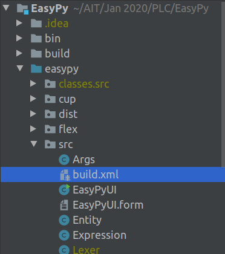
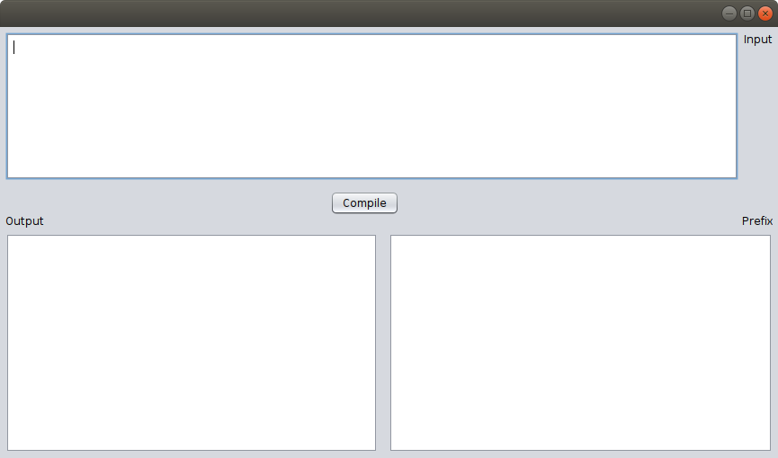

# EasyPy

EasyPy is a simple language that should be familiar to most programmers. It is inspired mainly by Java and Python. However, EasyPy was named as such for “easy as pie” and is not a variant or a subset of Python. The compiler for the language itself is run on Java and uses JFlex and CUP as the tokenizer and parser respectively. 

## Quickstart

### Keywords

**if, else, while, is, is not, int, float, bool, char, and, or, publish, true, false.**

### Tips

1. Every statement, including if and while statements, ends with a semicolon.
2. Variables must be declared before assignment.
3. Declaration and assignment is not allowed in one statement.
4. Use publish() statement instead of print().
5. All conditions for if and while statements i.e. comparisons and logical operators are enclosed in parentheses.
6. If/Else/While bodies must be enclosed with curly braces.
7. No type conversion is supported.
8. The comparison operator “==” is equivalent to “is” and “!=” is equivalent to “is not”.
9. Indentation is irrelevant.

### Running the compiler

The compiler is located in the project “EasyPy”. The GUI can be run by running the “run” Ant build task in the `build.xml` file. 
This build.xml file is located at `EasyPy>easypy>src>build.xml`. 



 - For Netbeans, simply right-click on it and click on Run Target>Other Targets>run. 

 - For Intellij, right-click on it, click ‘Add as Ant build file’ at the very bottom, then double-click the ‘run’ target on the right context menu.

The window below should show up. Simply paste the code snippet given in the top text area.



### Code Snippet

```
int x, a; char y, s, p; bool z; float d;

x = 3;
a = 23 % 6;
z = false;
p = "I'm going to say, 'I love you.'";

while (x < 5) {
    x = x + 1;
    publish(x);
};

publish(z);
while (z is false) {
    z = true;
};
publish(z);

publish(x);

if (x is a and z is true) {
    publish("x is 5 and z is true!");
}
else
{
    publish("x is not 5 or z is not true! Oh no!");
};

y = "Hello world ";
s = y + "everyone!";
x = (x + 2) * (4-2);
d = 4.3 + 3.22;
publish(x);

```
